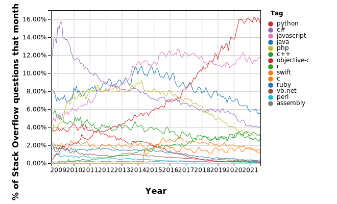

# Pandas

[Pandas](http://pandas.pydata.org/) is a an open source library providing high-performance, easy-to-use data structures and data analysis tools. Pandas is particularly suited to the analysis of _tabular_ data, i.e. data that can can go into a table. In other words, if you can imagine the data in an Excel spreadsheet, then Pandas is the tool for the job.

A [2017 recent analysis](https://stackoverflow.blog/2017/09/06/incredible-growth-python/) of questions from Stack Overflow showed that python was the fastest growing and most widely used programming language in the world (in developed countries).
As of 2021, the growth has now leveled off, but Python remains at the top.

[Link to generate your own version of this figure](https://insights.stackoverflow.com/trends?tags=java%2Cc%2Cc%2B%2B%2Cpython%2Cc%23%2Cvb.net%2Cjavascript%2Cassembly%2Cphp%2Cperl%2Cruby%2Cvb%2Cswift%2Cr%2Cobjective-c)

A [follow-up analysis](https://149351115.v2.pressablecdn.com/wp-content/uploads/2017/09/related_tags_over_time-1-2000x2000.png) showed that this growth is driven by the data science packages such as numpy, matplotlib, and especially pandas.

The exponential growth of pandas is due to the fact that it _just works_. It saves you time and helps you do science more efficiently and effictively.

## Pandas capabilities (from the Pandas website):

* A fast and efficient DataFrame object for data manipulation with integrated indexing;
* Tools for reading and writing data between in-memory data structures and different formats: CSV and text files, Microsoft Excel, SQL databases, and the fast HDF5 format;
* Intelligent data alignment and integrated handling of missing data: gain automatic label-based alignment in computations and easily manipulate messy data into an orderly form;
* Flexible reshaping and pivoting of data sets;
* Intelligent label-based slicing, fancy indexing, and subsetting of large data sets;
* Columns can be inserted and deleted from data structures for size mutability;
* Aggregating or transforming data with a powerful group by engine allowing split-apply-combine operations on data sets;
* High performance merging and joining of data sets;
* Hierarchical axis indexing provides an intuitive way of working with high-dimensional data in a lower-dimensional data structure;
* Time series-functionality: date range generation and frequency conversion, moving window statistics, moving window linear regressions, date shifting and lagging. Even create domain-specific time offsets and join time series without losing data;
* Highly optimized for performance, with critical code paths written in Cython or C.
* Python with pandas is in use in a wide variety of academic and commercial domains, including Finance, Neuroscience, Economics, Statistics, Advertising, Web Analytics, and more.

In this lecture, we will go over the basic capabilities of Pandas. It is a very deep library, and you will need to dig into the [documentation](http://pandas.pydata.org/pandas-docs/stable/) for more advanced usage.

Pandas was created by [Wes McKinney](http://wesmckinney.com/). Many of the examples here are drawn from Wes McKinney's book [Python for Data Analysis](http://shop.oreilly.com/product/0636920023784.do), which includes a github repo of [code samples](https://github.com/wesm/pydata-book).
